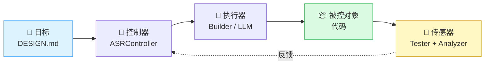
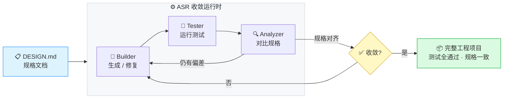

<div align="center">

<br>

# ⚙️ ASR — AI Software Runtime

### 基于控制论的自治式 AI 软件工程收敛运行时

<br>

从一份 `DESIGN.md` 出发，自动生成完整工程项目代码，<br>
通过 Builder → Tester → Analyzer 闭环迭代，持续收敛直到测试全通过且规格对齐。

<br>

[](#)
[](#)
[](#)
[](#)
[](#)

<br>

[🚀 快速开始](#-快速开始) · [📖 技术报告](./AI%20Software%20Runtime(ASR)技术报告.md) · [🌐 在线演示](https://georgewangchn.github.io/AI-Software-Runtime/)

<br>

</div>

---

> ### 💡 核心理念
> **一个弱模型 + 强约束系统 > 一个强模型 + 无约束系统**
>
> 不需要 Claude，不需要 GPT 配额。ASR 把 LLM 当执行器（不可控、有随机性），用控制论闭环驱动它稳定收敛——任意 OpenAI 兼容接口即可运行。

---

## ✨ 核心特性

ASR 本质是一个**控制论闭环**——把 LLM 当执行器，用反馈驱动它稳定收敛：



### 🔒 五重控制论保障

| 控制论要求 | ASR 实现机制 |
|:---|:---|
| 🎯 **反馈可靠** | `test_pass_rate` 作为地面真值，Analyzer 语义信号降级为辅助 |
| 🔧 **执行器可约束** | RepairMode 状态机（6 模式）+ Patch 限幅 + Formal Guards 硬约束 |
| ⚖️ **系统稳定** | 振荡检测（三重指纹）+ Circuit Breaker + 退化回滚 + Hysteresis 防抖 |
| 📡 **可观测** | ConvergenceMetrics（15+ 字段）+ 全事件文件化存储 + 可回放 |
| 🎛️ **可控制** | RepairMode 自动切换 + FINAL_VERIFICATION 防假收敛 + Failure Fingerprint |

### 🚀 v2.0 新增优化

| 优化项 | 核心机制 | 效果 |
|:---|:---|:---|
| **增量测试** | 基于 diff + import 依赖图只跑受影响测试 | 反馈延迟 O(全量) → O(子集)，每 3 轮全量校准 |
| **前馈控制** | session reset 后注入结构化 context | Builder 不再"失忆"重复错误修改模式 |
| **双传感器仲裁** | test_pass 与 Analyzer 分歧时触发仲裁 | 防止假收敛逃逸 |
| **自适应限幅** | patch 限幅按 trend / mode 动态调整 | 振荡收紧 1/3，improving 放宽 1.5x |
| **A/B 回滚** | 回归 >15% 立即回滚至 best snapshot | 即时止损，不等 mode 切换 |
| **可观测导出** | metrics_timeline 导出为时序 JSON | 收敛轨迹事后可分析 |

---

## 🏗️ 工作原理



> 每轮循环由控制论引擎驱动：实时计算 `test_pass_rate` 趋势、检测振荡、自动切换 RepairMode，确保系统稳定收敛而非无限振荡。


<details>
<summary><b>📋 RepairMode 状态机（点击展开）</b></summary>

<br>

六种修复模式，每种实质改变 Controller 对 Builder 的调用方式，通过 hysteresis 自动切换：

```
INITIAL_GENERATION → TEST_FIX ←─────────────────────┐
                       ↓ (stalled ≥ 2)               │
                   SPEC_COMPLETION                    │
                       ↓ (oscillation ≥ 0.7)         │
                   OSCILLATION_BREAK ──(improving ≥ 2)──┘
                       ↓ (regressing ≥ 2)
                   REGRESSION_RECOVERY ──(improving ≥ 1)──→ TEST_FIX
                       ↓ (tests pass, no analyzer)
                   FINAL_VERIFICATION ──(ALL CLEAR)──→ ✅ 收敛
```

</details>

<details>
<summary><b>🛡️ Formal Guards — 硬约束三件套（点击展开）</b></summary>

<br>

| Guard | 检测内容 | 动作 |
|:---:|---|---|
| 测试删除检测 | Builder 删除了 `test_*.py` 或 `tests/` 下的文件 | 拒绝 patch + 回滚 |
| 语法检查 | 对所有 `.py` 文件执行 `ast.parse()` | 拒绝 patch + 回滚 |
| Bypass 检测 | `except:`、`return expected`、`@pytest.mark.skip`、生产代码中的 `mock` | 拒绝 patch + 回滚 |

</details>

---

## 🚀 快速开始

### 环境要求

| 依赖 | 版本 | 说明 |
|---|---|---|
| 操作系统 | macOS / Linux | — |
| Python | 3.12+ | 推荐 pyenv 管理 |
| Node.js | 18+ | opencode CLI 依赖 |
| opencode CLI | >= 1.15 | LLM 调用后端 |

### Step 1 — 安装 ASR

```bash
git clone https://github.com/georgewangchn/AI-Software-Runtime.git
cd AI-Software-Runtime

python -m venv .venv
source .venv/bin/activate
pip install -e .
```

### Step 2 — 安装 opencode CLI

```bash
npm install -g opencode-ai
opencode --version
```

### Step 3 — 初始化项目

```bash
asr init --project my_project
```

自动生成 `DESIGN.md`（规格模板）+ `.opencode/config.json`（LLM 配置模板）+ `asr_config.yaml`。

### Step 4 — 配置 LLM

编辑 `my_project/.opencode/config.json`，填入你的 LLM provider：

```json
{
  "$schema": "https://opencode.ai/config.json",
  "provider": {
    "local": {
      "npm": "@ai-sdk/openai-compatible",
      "name": "Local LLM",
      "options": {
        "baseURL": "http://127.0.0.1:8000/v1",
        "apiKey": "empty"
      },
      "models": {
        "glm-4.7-fp8": {
          "name": "glm-4.7-fp8",
          "limit": { "context": 262144, "output": 32768 }
        }
      }
    }
  },
  "model": "local/glm-4.7-fp8"
}
```

> 支持任意 OpenAI 兼容接口：vLLM / Ollama / OpenAI 官方 / DeepSeek 等。

### Step 5 — 环境检查

```bash
asr doctor --project my_project
```

### Step 6 — 运行

```bash
asr run --project my_project --max-iterations 20
```

ASR 会自动：Builder 生成代码 → Tester 验证 → Analyzer 对比规格 → 循环修复直到收敛。

```
ASR 收敛运行时 [直接模式]
项目路径: my_project
最大迭代轮次: 20

  [第1轮] 代码生成  错误:0  🔧  | 补丁:0 文件:3 代码行:156 初始生成
  [第2轮] 测试验证  错误:3  ❌  | 通过:12/15 失败:test_foo,test_bar
  [第3轮] 代码修复  错误:3  🔧  | 修复3个失败 pass_rate=0.80 trend=improving
  [第4轮] 测试验证  错误:0  ✅  | 通过:15/15
  [第5轮] 规格分析  错误:0  ✅  | 规格:一致

✅ 已收敛 — 所有测试通过且规格一致
迭代轮次: 5 | 事件数: 23
```

---

## 📁 项目结构

```
asr/
├── asr/                              # 核心代码
│   ├── agents/                       # 智能体
│   │   ├── builder.py                #   Builder：代码生成与修复（带会话延续）
│   │   ├── tester.py                 #   Tester：pytest 执行（Sandbox 隔离 + 增量测试）
│   │   ├── analyzer.py               #   Analyzer：diff-only + 结构化偏差分析
│   │   ├── opencode_backend.py       #   opencode CLI 子进程调用后端
│   │   └── llm_tracker.py            #   Token 消耗追踪
│   ├── controller/
│   │   └── convergence.py            # 收敛控制器（~1400行）
│   ├── cli/
│   │   └── main.py                   # CLI 入口（init / doctor / run / compare）
│   ├── config/                       # Pydantic v2 配置模型
│   ├── events/                       # 20 种事件类型 + EventStore
│   ├── dag/                          # Task DAG 并行执行
│   └── runtime.py                    # 运行时入口
├── tests/                            # 单元测试（226 passed）
├── pyproject.toml                    # 包定义 + asr CLI 入口
└── .env.example                      # 环境变量配置模板
```

---

## 📚 参考

<details>
<summary><b>CLI 命令速查</b></summary>

| 命令 | 说明 |
|---|---|
| `asr init --project <dir>` | 初始化项目（生成 DESIGN.md 模板 + opencode 配置） |
| `asr doctor --project <dir>` | 环境预检（opencode / Python / DESIGN.md / config） |
| `asr run --project <dir> --max-iterations N` | 运行收敛循环 |
| `asr compare --project <dir> --spec <yaml>` | 对比方案效果 |

</details>

<details>
<summary><b>环境变量</b></summary>

| 变量 | 必填 | 说明 |
|------|:---:|------|
| `FEASIBILITY_LLM_API_BASE` | ✅ | OpenAI 兼容接口地址 |
| `FEASIBILITY_LLM_API_KEY` | ✅ | API 密钥（本地部署可填 `empty`） |
| `FEASIBILITY_LLM_MODEL` | ✅ | 模型名称 |
| `FEASIBILITY_LLM_CONTEXT` | | 上下文窗口大小（默认 131072） |
| `ASR_OPENCODE_TIMEOUT` | | opencode 调用超时秒数（默认 24400） |
| `ASR_VERBOSE` | | 设为 `1` 启用详细日志 |

</details>

### 相关文档

| 文档 | 说明 |
|---|---|
| 📖 [技术报告 (v2.0)](./AI%20Software%20Runtime(ASR)技术报告.md) | 系统架构设计、控制论优化体系、端到端验证、DAG 调度、事件总线 |
| 💡 [原始构想](./Supervise-Agent：有监督长任务自动化软件工程系统.md) | 项目最初想法：分层裁决 + 多Agent协同 + 工程约束 |
| 🌐 [在线演示](https://georgewangchn.github.io/AI-Software-Runtime/) | 系统效果验证测试报告，对比四种方案的实际生成效果 |

---

<div align="center">

**MIT License**

</div>
